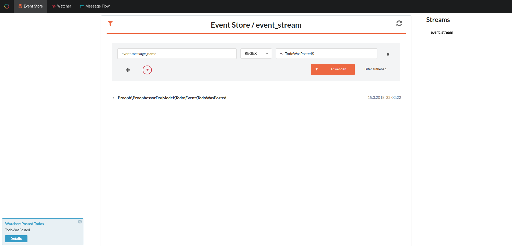
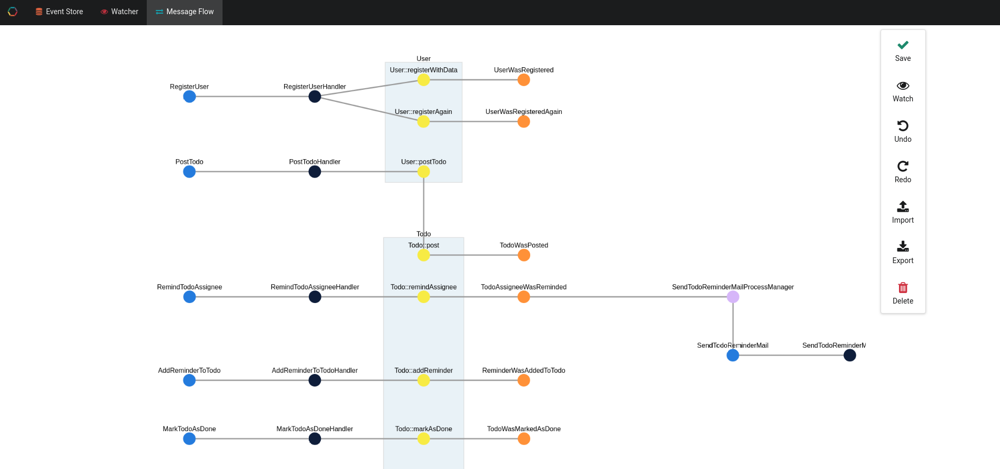
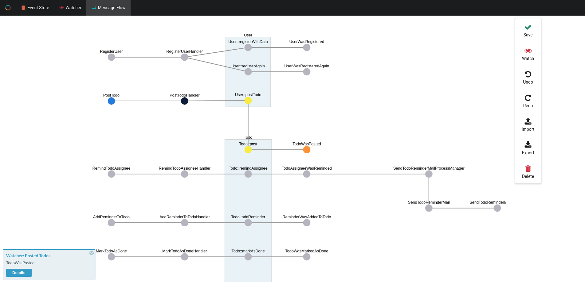

# PROOPH EVENT STORE MGMT UI

The proophessor-do application ships with an integrate [prooph Event Store Mgmt UI](https://github.com/prooph/event-store-mgmt-ui)
You can access the UI by clicking on the menu item **Management UI** in the main menu of proophessor-do.

*Note: The Management UI is in an early stage. We're collecting feedback and work on some more features. You can find a roadmap [hvere](https://github.com/prooph/event-store-mgmt-ui/issues/1)*

## Inspecting The Event Stream

proophessor-do uses a single event stream by default. Just go and post some TODOs using the frontend application.
Then switch back to the management ui and click on the "Event Store" item in the top menu.

Select the **event_stream** from the right side and you will see the latest events recorded in the stream.

Left to the headline "Event Store / event_stream" you can find a filter icon. On click it opens a filter menu
that allows you to filter the event stream.

Add a filter to only show posted TODOs: 
- Property: `event.message_name`
- Operator: `REGEX`
- Filter: `^.+TodoWasPosted`

Then press CTRL+ENTER or press the apply button.

## Adding a Watcher

The management UI ships with a very neat feature called "stream watcher". You can set up watchers based on filters like
the one shown above to get notifications in the management UI when a new event is added to a stream that matches the filter
criteria. This can be very useful for debugging event sourced application or monitoring business errors recorded as events.

Let's try it! You still have the posted TODOs filter from above? Now click on the **red eye icon** next to the plus sign.
A pop up will ask you to provide a name for the new watcher. Just call it **Posted Todos**

Now open proophessor-do in another tab: [http://localhost:8080](http://localhost:8080)
and post a new Todo. Then switch back to the managment UI tab. You should see a notification from the watcher.

The notification contains a **details** button. This redirects you to the watcher tab and the correct watcher so that you can
inspect the new event.

## Message Flow Analyzer

We provide a package called [prooph/message-flow-analyzer](https://github.com/prooph/message-flow-analyzer) (work in progress).
The package scans your prooph based event sourcing application and analyzes the message flow through your system.
The result can be visualized in the management UI.

We've prepared a scan of proophessor-do for you. Download the [file](message_flow.json).
Switch to the **Message Flow** tab that you can find in the top menu. You'll see an empty workspace.

Drop the downloaded **message_flow.json** on the workspace and you'll see the message flow of proophessor-do visualized as a graph.

Amazing! Isn't it? But that's not all. You can combine active watchers with the message flow. Let's try it.
We have our **posted todos** watcher listening on new events. In the message flow menu on the right you can find
again a **watch button with an eye icon**. Click on it. The message flow will be greyed out.

Post another Todo using proophessor-do app and check the message flow again ;)

## Technical Details

tbd